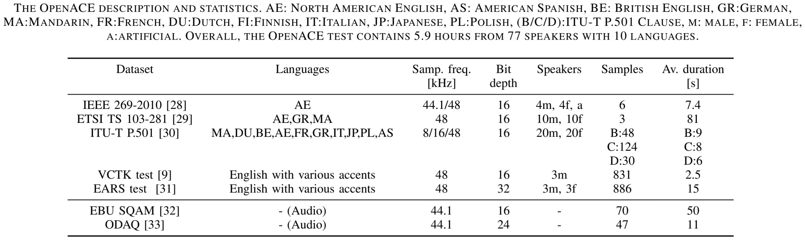

<div align="center">    
 
# OpenACE

</div>
 
## Description   
This repository contains the code to generate the OpenACE dataset. The code allows for the automatic application of codecs, and is easily extensible to any other codecs. Currently only tested on Ubuntu Linux. 

## Installation and data download

Follow the installation, setup, and data download in [INSTALL.md](INSTALL.md).

## Data

The openACE benchamark is a collection of open-source datasets that are released with various data file formats, number of channels, sampling frequencies and the bit depth. The downloaded data is located in `data/original`, together with generated `metadata.csv`.



Subsets can be easily obtained from the metadata file, for example:
```sh
# All 32 bit encoded audio files
grep '32 bit' data/original/metadata.csv | awk -F, '{print $2}' # .flac or .wav, mono or strereo, etc.
```

In most of use-cases the unified audio format (*.wav), the number of channels (mono) and the bith depth (16 bits) is desired. You can obtain it with
```sh
conda activate CodecBenchmark
./preprocess_data.sh # process data/original and saves it in data/mono-16bit-wav

# Get all fullband files
grep -E '44100|48000' data/mono-16bit-wav/metadata.csv | awk -F, '{print $2}'
```

## How to use

### Audio encoding and decoding
Run the following to apply the codecs to the fullband signals in the benchmark
```sh
conda activate CodecBenchmark; cd src
python -m apply_codecs bitrate=BITRATE data_subsets=fullband
```
You can use `test_run=True` option to run a limited number of files (10) test.

This will create a directory tree in the `data/processed/` folder. One directory per original reference file will be created. Thereafter the codecs defined in the `src/confic/codecs/default.yaml` file will be applied to the audio and saved to the respective folder. 
A metadata file will be generated at the end of the process at `data/processed/.../metadata.csv` containing the paths to the encoded files.

### Creating Your Own Codec

To implement a custom codec, you need to create a class that inherits from the `AbstractCodec` class located in `src/codec_wrappers/codecs.py`. Your implementation must include the following method:

```python
__call__(self, input_file: str, output_file: str, bitrate: int)
```

This method handles reading the `input_file`, applying the codec logic, and saving the processed data to the specified `output_file` as a `.wav`. Additionally, your class should define an attribute `self.name` (name of the codec), which determines the structure of the output folder. For guidance, review the existing codec implementations in the `src/codec_wrappers/codecs.py` file.

To use your custom codec (or any codec), create a `yaml` configuration file in the `src/config/codec` directory with the following structure:

```yaml
yourcodec:
  _target_: codec_wrappers.codecs.YourCodecClass
  some_init_argument: foobar  

yourothercodec:
  _target_: codec_wrappers.codecs.YourOtherCodecClass
  some_other_init_argument: bazz  
```

Alternatively, you can integrate your codec configuration into the `default.yaml` file to include it alongside the pre-existing codecs.

Once configured, you can apply your codec to the data by running the following command, replacing `YOUR_CODEC_CONFIG_NAME` with the appropriate name from your YAML file:

```
python -m apply_codecs codecs=YOUR_CODEC_CONFIG_NAME
```

For more detailed usage, refer to the "Examples" section.

### VISQOL Computation
To compute VISQOL scores for the encoded files relative to their reference, a script is provided. After running the dataset generation the script can be run with the following command:

```sh
python -m compute_visqol_scores metadata_file=PATH_TO_METADATA_FILE
```

## Examples

### Visqol scores reproduction
To reproduce the VISQOL results of table 3 of our paper the following commands be run assuming that the source data is downloaded, and that the environment is set up. 
- Generate the 16 kb/s dataset `python -m apply_codecs bitrate=16400 data_subsets=fullband`
- Compute VISQOL scores `python -m compute_visqol_scores metadata_file="PROJECT_ROOT/data/processed/codecs\=default-dubset\=fullband-bitrate\=16/metadata_bitrate\=16.csv"`
- This will save a csv file containing the VISQOL scores in the folder containing the metadata. 
- Repeat for bitrates {32000, 64000} 

## Citation
If you use the OpenACE dataset in any of your research, please cite the following paper:

```
@misc{coldenhoff2024openaceopenbenchmarkevaluating,
      title={OpenACE: An Open Benchmark for Evaluating Audio Coding Performance}, 
      author={Jozef Coldenhoff and Niclas Granqvist and Milos Cernak},
      year={2024},
      eprint={2409.08374},
      archivePrefix={arXiv},
      primaryClass={eess.AS},
      url={https://arxiv.org/abs/2409.08374}, 
}
```

# Extra info
## Equivalent codec commands 

### liblc3

```sh
$ alias elc3="LD_LIBRARY_PATH=`pwd`/bin `pwd`/bin/elc3"
$ alias dlc3="LD_LIBRARY_PATH=`pwd`/bin `pwd`/bin/dlc3"
$ elc3 <in.wav> -b <bitrate> | dlc3 > <out.wav>
```

### LC3Plus ETSI
```sh
LC3plus <in.wav> <out.wav> <bitrate>
```

### OPUSEnc opus-tools
```sh
opusenc --quiet --hard-cbr --bitrate <bitrate> - - | opusdec --quiet <out.wav>
```

### EVS ETSI reference implementation
Uses binary audio files for input and output, so wrapper converts them to this file format.
```sh
EVS_cod -q -mime <bitrate> <sample rate kHz> <in.raw> <out.bitstream>
EVS_dec -q <sample rate kHz> <out.bitstream> <out.raw>
```
